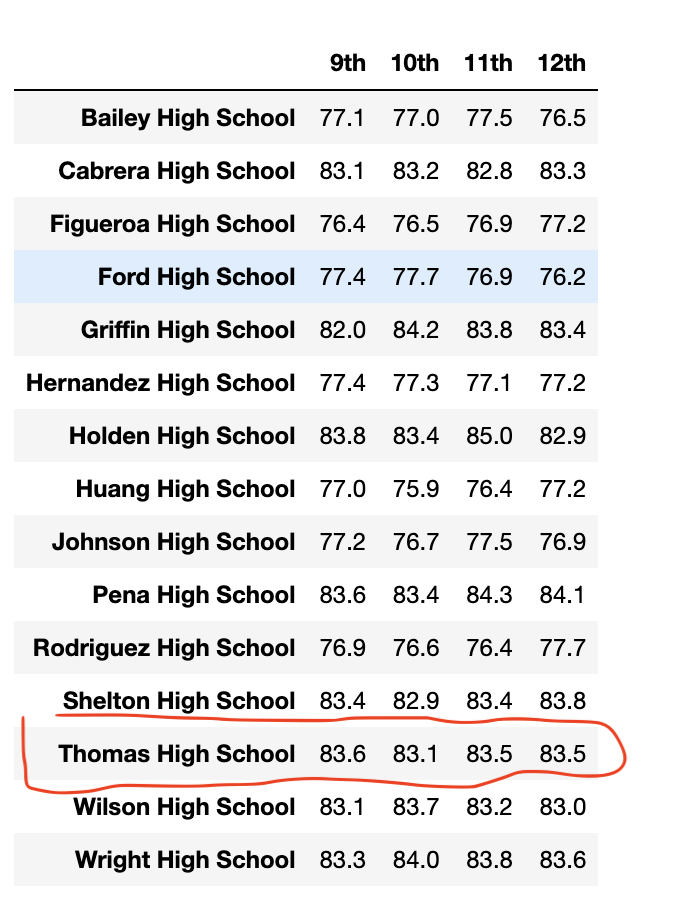
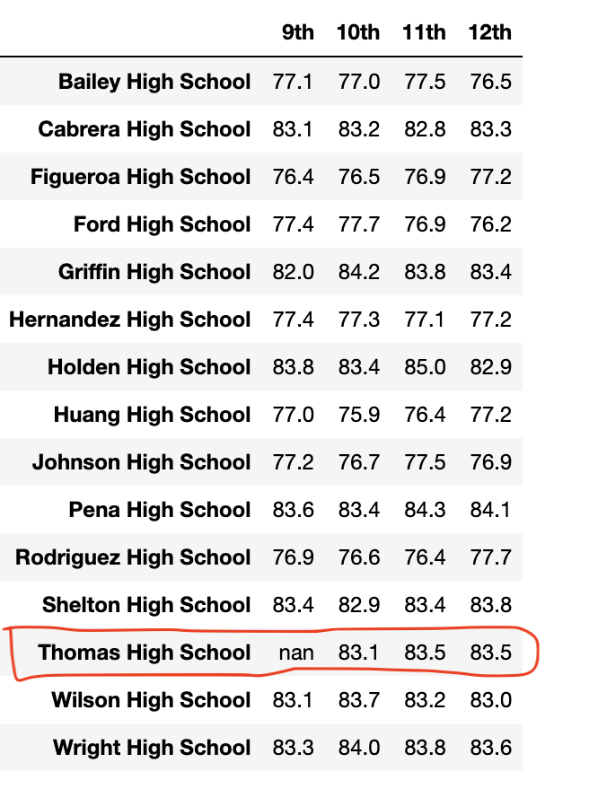
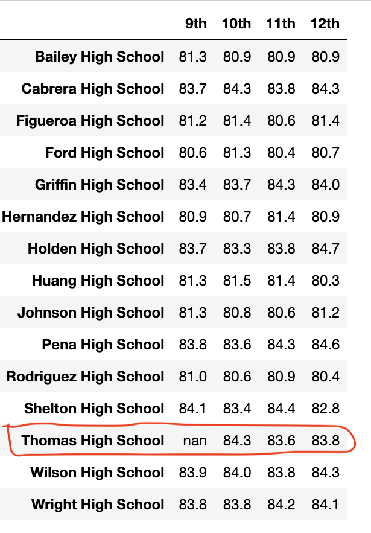

# School District Analysis
## Overview
A chief data scientist for a city school district has given tasks to analyze and report student funding and standardized test scores as below:
- A high-level snapshot of the district's key metrics, presented in a table format.
- An overview of the key metrics for each school, presented in a table format.
- Tables presenting each of the following metrics:
  - Top 5 and bottom 5 performing schools, based on the overall passing rate.
  - The average math score received by students in each grade level at each school.
  - The average reading score received by students in each grade level at each school.
  - School performance based on the budget per student.
  - School performance based on the school size.
  - School performance based on the type of school.
- Analyze and compare the above school metrics while excluding the ninth grade reading and math scores of Thomas High School.

## Resources
- Requirements from the client
- Anaconda3-2022.05 
- Conda 4.14.0
- Jupyter Notebook 6.4.8
- ipykernel 6.9.1
- Python 3.7.13
- Pandas 1.3.5
- Numpy 1.21.5

## School District Results
The district and school summary along with other metrics  were calculated for the school district initially. Later on, the reading and math scores of **461** students in the ninth grade of Thomas High School were turned into null data due to academic dishonesty. The school metrics were recalculated to observe the impact. 

- ### Effect on District Summary:
  - The total number of schools, students and total budget for the district remained the same. 
  - There was less than 1% decrease on the district's average math, average reading, passing math and passing reading percentages and also the overall passing percentages after the adjustments. The whole number percentages remained the same, when rounded. So it can be concluded that there was little to no impact on the overall school district metrics post adjustment.
<table>
<tr><td> Original District Summary:</td></tr>
<tr><td></td></tr>
<tr><td> Adjusted District Summary:</td></tr>
<tr><td> </td></tr>
</table>

- ### Effect on School Summary:
  - The original school summary showed that Thomas High School had an overall passing percentage of around 91%.
  - The adjusted school summary calculated the overall passing scores considering the total number of 10th - 12th grade students only. 
  - By removing the math and reading scores of ninth graders from the analysis, the overall passing percentage came down significantly from 91% to 65%.   - The school's passing math and reading percentages also dropped over 25%.
<table>
<tr><td> Original School Summary:</td></tr>
<tr><td></td></tr>
<tr><td>Adjusted School Summary: </td></tr>
<tr><td></td></tr>
</table>

- ### Effect on Thomas High School's Performance:
  - In the original analysis, Tomas High School ranked second in the district.
<table>
<tr><td>Results from original School Performance</td></tr>
<tr><td></td></tr>
<tr><td>Results from adjusted School Performance</td></tr>
<tr><td></td></tr>
</table>

- ### Effect on Grade level Math and reading scores:
  - Thomas High School had 83.6 as average math score for the ninth grade tests while the adjusted showed as null values represented as "nan" in Python.
  - The school also had 83.7 as average reading score for ninth grade tests. The adjustments showed null values in the same category.
<table>  
<tr>
  <td> Original Grade level Math Scores: </td>
  <td> Adjusted Grade level Math Scores: </td>
</tr>
<tr>
  <td></td>
  <td></td>
</tr>
<tr>
  <td>Original Grade level Reading Scores:</td>
  <td>Adjusted Grade level Reading Scores:</td>
</tr>
<tr>
  <td></td>
  <td></td>
</tr>
</table>

- ### Scores by School Spending:
  - Thomas High School came into the spending range of $630-$644 per student.
  - The adjustment saw less than 0.01% of decrease in scores by school spending. So, it can be concluded that school spending was not impacted much by the adjustment. 
<table>
<tr><td> Original Scores by School Spending:</td></tr>
<tr><td></td></tr>
<tr><td>Adjusted Scores by School Spending: </td></tr>
<tr><td></td></tr>
</table>

- ### Scores by School Size:
  - Thomas High School proved to be a Medium sized school.
  - The adjustment saw less than 0.01% of decrease in scores by school size. So, it can be concluded that school size was not impacted much by the adjustment. 
<table>
<tr><td> Original Scores by School Size:</td></tr>
<tr><td></td></tr>
<tr><td>Adjusted Scores by School Size: </td></tr>
<tr><td></td></tr>
</table>

- ### Scores by School Type:
  - Thomas High School is a Charter school. 
  - Less than 0.01% decrease on school type was noticed upon adjusting the ninth grade scores. 
  - It can be concluded that school type was not impacted much by adjusting the scores.
<table>
<tr><td> Original Scores by School Type:</td></tr>
<tr><td></td></tr>
<tr><td>Adjusted Scores by School Type: </td></tr>
<tr><td></td></tr>
</table>

## School District Summary  
### Below are four changes noticed in the updated school district analysis after reading and math scores for the ninth grade at Thomas High School have been replaced with NaNs:
- The overall pass percentage of Thomas High School came down significantly from 91% to 65%.
- The school's pass percentages for both math and reading dropped by 25%.
- The ninth grade level math and reading scores for Thomas High School showed up as nan, signifying null data.
-
-

